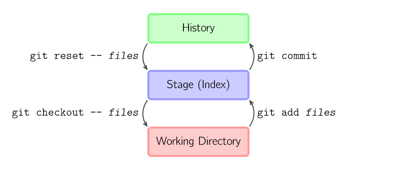

==============================
Git CLI
==============================

| For an introduction to command line use of git in the terminal (CLI) see: https://www.youtube.com/watch?v=HVsySz-h9r4&list=PL-osiE80TeTuRUfjRe54Eea17-YfnOOAx
| Below are some git CLI commands that might be useful.
| For the book that was the basis of the videos, see: https://git-scm.com/book/en/v2
| For diagrams that help show what is happening: https://marklodato.github.io/visual-git-guide/index-en.html
| See: https://www.youtube.com/watch?v=uR6G2v_WsRA

----

Git Help
------------------------------

Help formats:

.. code-block::

    git config --Help
    git help config

----

2 scenarios:
------------------------------

#. Existing project on local machine
#. Clone remote project to work on

----

============================================================
Existing project on local machine
============================================================

Initialize the repository on local machine
------------------------------------------------------------

To initialize a repository from existing code, first change the command line directory to the project folder:

.. code-block::

    cd "C:\repos\PC-using-RTD"

Sometimes you may already be in a subfolder and just need to go up to the parent folder:

.. code-block::

    cd ..

(Also, handy for git use is:) To move the working directory to a subfolder:

.. code-block::

    cd mydir/

To Initialize the repository:

.. code-block::
    
    git init

----

Ignore files
------------------------------

Add the ``.gitignore`` file from within the **project** folder.

.. code-block::

    type nul > .gitignore

Edit the ``.gitignore`` file to list on each line any files of folders to be ignored by git.

----

Working tree -> Staging Area -> History
-------------------------------------------------

| The Working tree is a directory of files in the project.
| The staging area and History are in the .git folder.

The steps that a file takes to have an updated version of it added to the github repository are:

| The file is changed in the working directory (tree). Files can be created, modified or deleted.
| Then the change is added to the staging area using the **git add** command.
| then the change is included in the next commit using the **git commit** command.
| Then the commit is pushed to the remote at github.

----

Add files to Staging Area
------------------------------

See: https://www.youtube.com/watch?v=tcd4txbTtAY&list=PL-osiE80TeTuRUfjRe54Eea17-YfnOOAx&index=6

Files added to the staging area are changed files: new, modified or deleted.

To add all changed files within the **project** folder to the staging area:

.. code-block::

    git add

To add a single file from within the **project** folder to the staging area:

.. code-block::

    git add filename

To add a single folder from within the **project** folder to the staging area:

.. code-block::

    git add directory/

To add all the changed files within the working directory (from which it is run in terminal) to the staging area:

.. code-block::

    git add .

| Options for adding files: 
| The -A option is the default behaviour.
| git add -A (or git add or git add --all) stages all the changes in the whole working project folder (tree).
| git add -A mydir/  stages all the changed files in that directory.
| git add mydir/  stages all the changed files in that directory (-A is the default).
| git add . is the same as git add -A mydir/ for the working directory from which it was run.
| git add -u (or git add --update) stages all the modified and deleted files (tracked files) in the whole working tree, but not new files (untracked files).
| git add -u mydir/ does only the modified and deleted files (tracked files) in that directory, but not new files (untracked files).

----

Git Status
------------------------------

To check the status of the git:

.. code-block::

    git status

| It outputs the current working branch and how it compares to the remote master branch.
| It lists file changes that are not yet staged.
| It lists the staged files.
| It reports whether there are local commits yet to be published.

----

Remove files from Staging Area
--------------------------------

To remove a single file from within the **project** folder from the staging area:

.. code-block::

    git rm --cached filename

    or

    git reset filename

To remove all files from within a subfolder within the **project** folder from the staging area:

.. code-block::

    git rm -r --cached foldername

To remove all files within the **project** folder from the staging area:

.. code-block::

    git reset

----

Commit files from Staging Area
--------------------------------

To commit files from staging area:

.. code-block::

    git commit -m "First commit"

To add files to staging area and commit at once:

.. code-block::

    git commit -a -m "Second commit"
    or
    git commit -am "Second commit"

----

View Commit history
--------------------------------

To check commits:

.. code-block::

    git log

For a more concise log to check commits:

.. code-block::

    git log --graph --oneline --decorate

----

Rename branch
--------------------------------

To rename current branch:

.. code-block::

    git branch -M newname

----

============================================================
Clone remote project to work on
============================================================

Clone a git repository
------------------------------------------------------------

Clone a git repository to a local folder.

.. code-block::

    git clone <url> <destination>

Use a dot for the destination to use the working directory as the destination.

.. code-block::

    git clone https://github.com/gmc-code/PC-Using-RTD.git .

Use a foldername within the working directory as the destination.

.. code-block::

    git clone https://github.com/gmc-code/PC-Using-RTD.git "clonedrepo"

----

View information about remote repository
------------------------------------------------------------

To list info about the repository:

.. code-block::

    git remote -v

To list all the local and remote branches in the repo:

.. code-block::

    git branch -a

----

View changes made 
------------------------------

To show changes to files:

.. code-block::

    git diff

----

Commit changes to files
------------------------------

To commit files from staging area:

.. code-block::

    git diff
    git status
    git add -A
    git status
    git commit -m "changes made"

----

Pull and Push commit to remote repo
------------------------------------

Pull from remote first to include other users changes then push:

.. code-block::

    git pull origin master

Pull will list changes in remote repo since last pull from it.
Origin is the name of the remote repo and master is the branch.
Push updates the remote branch:

.. code-block::

    git push origin master

----

Create branch for desired feature to work in
------------------------------------------------------------

Create new branch:

.. code-block::

    git branch mygitcmds

List local branches; the working branch will be listed with an asterisk:

.. code-block::

    git branch

To change to a local branch to work on it:

.. code-block::

    git checkout mygitcmds

Push branch to remote repo:

.. code-block::

    git push -u origin mygitcmds

``-u`` associates local with remote branch of same name so ``git pull`` and ``git push`` can be done in future without the other parameters.

To list all the local and remote branches in the repo:

.. code-block::

    git branch -a

----

Merge a branch
------------------------------

Steps to merge ``mygitcmds`` branch to master branch:

.. code-block::

    git checkout master
    git pull origin master
    git branch --merged
    git merge mygitcmds
    git push origin master

----

Delete a branch after merging it
------------------------------------------------------------

Steps to delete ``mygitcmds`` branch:

.. code-block::

    git branch --merged  
    git branch -d mygitcmds
    git branch -a
    git push origin --delete mygitcmds

----

Remove file from commit not yet pushed
------------------------------------------------------------

Undo changes in a file ``filename``:

.. code-block::

    git checkout filename

----

Change commit message not yet pushed
------------------------------------------------------------

Undo commit message:

.. code-block::

    git commit --amend -m "New message"

----

Add a file created since last commit but not yet pushed
-----------------------------------------------------------

Add the file first:

.. code-block::

    git add filename
    git commit --amend

View details of changed files since last commit:

.. code-block::

    git log --stat

----

Move commit from master to feature branch not yet pushed
------------------------------------------------------------

Use this after accidentally make commit to master branch instead of feature branch. Move commit:

.. code-block::

    git log

Copy the hash of the master branch's last commit that needs moving.

Switch to feature branch:

.. code-block::
    
    git checkout <featurebranch> 

Copy the hash of last commit that needs moving. 

Copy commit to feature branch:

.. code-block::

    git cherry-pick <hash>

Check it.

.. code-block::

    git log

Then return master branch.

.. code-block::

    git checkout master
    git log

----

Soft reset
------------------------------

Then copy hash of initial commit to use in soft reset. 

.. code-block::

    git reset --soft <hash>
    git log
    git status

The soft reset kept work in modified files as shown by status.

----

Default reset
------------------------------

A mixed (default) reset keeps changes but they are left in working area and are not in staging area.

.. code-block::

    git reset <hash>
    git log
    git status

----

Hard reset
------------------------------

A hard reset returns track files back to state at time of the (hash) commit and leaves out changes from files.

.. code-block::

    git reset --hard <hash>
    git log
    git status

Untracked files left alone from hard rest can be removed:

.. code-block::

    git clean -df

``-d`` removed untracked directories; ``-f`` is to force changes

The working directory will then be clean as shown by:

.. code-block::

    git status

----

Recover from Hard reset
------------------------------

Get a log of commits in order from last commit:

.. code-block::

    git reflog

Copy a hash and check out that hash and check it using log:

.. code-block::

    git checkout <hash>
    git log

Make a branch from this detached HEAD state to save the changes:

.. code-block::

    git branch <new branch>

View branches to check:

.. code-block::

    git branch

----

Make changes when changes have been pushed
------------------------------------------------------------

Create new commits to undo changes.

Firstly, copy the hash for the commit to remove:

.. code-block::

    git log

Use the copied hash below:

.. code-block::

    git revert <hash>

View the commits:

.. code-block::

    git log

Use the has for the original commit and the reverted commit to compare them:

.. code-block::

    git diff <hash_original> <hash_reverted>

----

Git Stash
------------------------------

Use this when you want to store changes in a feature branch but not commit them yet.

.. code-block::

    git stash save "<message about context>"

All the changes will appear to be gone, but are stashed. To get a list of stashes:

.. code-block::

    git stash list

This lists the stash id, the branch and the message. 
To bring back the changes that were stashed:

.. code-block::

    git stash apply <stashID>

To return to were you were:

.. code-block::

    git checkout -- .

To apply the first stash and drop or delete the stash:

.. code-block::

    git stash pop

To drop a stash that is not needed:

.. code-block::

    git stash drop <stashID>

To drop all stashes:

.. code-block::

    git stash clear

----

Git Stash from master to feature branch
------------------------------------------------------------

Steps to take when accidentally working in master branch.

.. code-block::

    git stash save "feature in master for newfeaturebranch"
    git status
    git diff
    git checkout <newfeaturebranch>
    git stash pop
    git diff
    git add .
    git commit -m "new feature from master"

----

Remove the git tracking (delete hidden .git folder)
------------------------------------------------------------

* Use RMDIR /Q/S foldername  or RD /Q/S foldername
* /Q -- Quiet mode, won't prompt for confirmation to delete folders.
* /S -- Run the operation on all folders of the selected path.
* foldername -- The absolute path or relative folder name 
* So from within the repository folder

.. code-block::

    RD /Q/S .git

